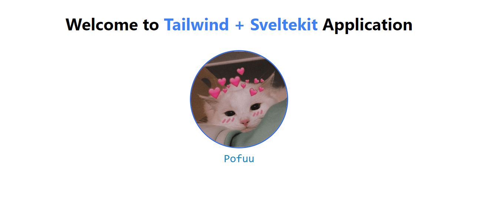

# Create Sveltekit + Tailwind CSS Application

## Version
```
  "@sveltejs/kit": "^1.5.0",
  "svelte": "^3.54.0",
```

## Installation

##### <code>folder-name</code> can be anything

```bash
  git clone https://github.com/SikandarJODD/SvelteKit-min.git folder-name
```

##### Install the code using

```bash
  npm i
```

##### Run the Code

```bash
  npm run dev -- --open

```

### Output :

<hr/>



<hr/>
